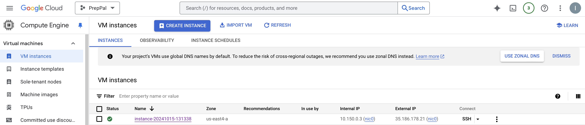
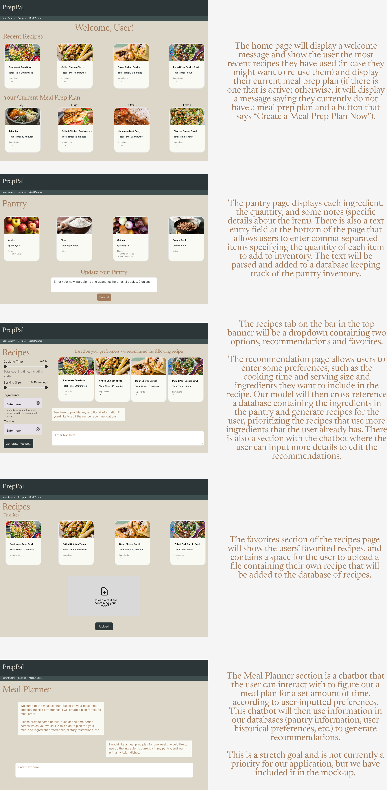

## AC215 PrepPal - Milestone 2

#### Project Milestone 2 Organization

```
├── README.md
├── data # DO NOT UPLOAD DATA TO GITHUB, only .gitkeep to keep the directory or a really small sample
├── notebooks
│   └── data_cleaning.ipynb
├── references
│   └── Doub_et_al.pdf
│   └── Lebersorger_Schneider.pdf
├── reports
│   └── PrepPal_Statement_of_Work.pdf
└── src
    ├── dataversioning
    │   ├── docker_entrypoint.sh
    │   ├── docker-shell.sh
    │   ├── Dockerfile
    │   ├── dvc_store.dvc
    │   ├── Pipfile
    │   ├── Pipfile.lock
    │   ├── test_connection.py
    ├── datapipeline
    │   ├── cli.py
    │   ├── docker-compose.yml
    │   ├── docker-entrypoint.sh
    │   ├── docker-shell.sh
    │   ├── Dockerfile
    │   ├── Pipfile
    │   ├── Pipfile.lock
    │   ├── preprocess_rag.py
    │   ├── preprocess_recipes.py
    │   ├── README.md
    └── models
        ├── Dockerfile
        ├── docker-shell.sh
        ├── infer_model.py
        ├── model_rag.py
        └── train_model.py
```

# AC215 - Milestone2 - PrepPal

**Team Members:** <br>
Ioana-Andreea Cristescu, Jonas Raedler, Rosetta Hu, Alice Cheng

**Group Name** <br>
PrepPal

**Project:** <br>
In this project, we aim to develop an AI-powered meal-planning application that streamlines recipe discovery and ingredient management. Powered by a Retrieval-Augmented Generation (RAG) model, the app suggests personalized recipes from a database of 300,000 meals, using available pantry ingredients and user preferences. Users can easily manage their pantry and saved recipes, with the app dynamically adjusting recommendations based on updates. A fine-tuned model enhances the user experience by prioritizing recipes that align with personal tastes and pantry stock, helping reduce food waste and simplify meal preparation.

### Milestone2

In this milestone, we created a virtual machine instance with GPU on Google Cloud Platform to run and host our embedding and fine-tuned models. We set up a GCP bucket for data storage and implemented robust data versioning practices. One of the key developments in this milestone was building a RAG pipeline, which involved cleaning, chunking, embedding, and loading a dataset of around 300,000 recipes into a vector database. Additionally, we synthetically generated a dataset to fine-tune a large language model and integrated it with the RAG retrieval system. For further details, please refer to each container outlined below.

### Instructions to run our application 

**GCP Setup:** <br>
1. Virtual Machine 
   * Create a VM Instance from [GCP](https://console.cloud.google.com/compute/instances)
      - Region: us-east4-a (can choose any region that supports the type of machine chosen)
      - Machine Configuration:
         - GPU type: NVIDIA T4
         - Machine Type: g2-standard-4
         - Memory: 200 GB (at least)
      - You can choose a lower tier GPU that runs with 4-8 vCPUs. We had to upgrade to NVIDIA L4 due to unavailability of other GPUs.
   * SSH into your newly created instance
   * Install Docker on the newly created instance by running: `sudo apt install docker.io`
   * Install docker-compose: 
      - `sudo curl -L "https://github.com/docker/compose/releases/download/1.29.2/docker-compose-$(uname -s)-$(uname -m)" -o /usr/local/bin/docker-compose`
      - `chmod +x /usr/local/bin/docker-compose`
      - To test your installation of Compose, run the following command: `docker-compose --version`
   * Install Git: sudo apt install git
   * Clone App Repo: git clone https://github.com/acheng257/ac215_PrepPal.git



2. GCP Bucket
    * Navigate to Storage > [Buckets](https://console.cloud.google.com/storage/browser) and click create bucket
        - Name: any unique bucket name
        - Region: us-east1
    * Create a folder `dvc_store` inside the bucket for data versioning using dvc
    * Create other folders inside the bucket to store data
3. Service Account
    * Navigate to IAM & Admin > [Service Accounts](https://console.cloud.google.com/iam-admin/serviceaccounts)
    * Click + Create Service Account
    * Name the service account and click Create and Continue.
    * Assign a role with the premission to access the GCS Bucket above:
      - Storage Admin (full access to the bucket)
    * Click on the service account and navigate to the tab "KEYS"
    * Click in the button "ADD Key (Create New Key)" and Select "JSON". This will download a private key JSON file.
    * Create a local **secrets** folder
      ```
           |-ac215_Preppal
           |-secrets
        ```
    * Copy the above key JSON file into the secrets folder and rename it to `data-service-account.json`


**Containerized Components:** <br>
1. [Data Versioning Container](./src/dataversioning/README.md)
    * The DVC container sets up version control using open-source DVC (Data Version Control) to efficiently manage data versions. The pipeline connects to Google Cloud Storage (GCS) and mounts a GCS bucket to a local directory. Additionally, it binds this mounted directory to another path to serve as the storage location for DVC-managed data. This setup allows us to seamlessly track, version, and manage large datasets that are stored in the cloud.
3. [RAG Data Pipeline Containers](./src/llm-rag/README.md)
   * The RAG Data Pipeline includes two integrated containers: one for the data pipeline and another for ChromaDB. The data pipeline container manages tasks such as cleaning, chunking, embedding, and integrating data into the vector database, while the ChromaDB container hosts the vector database. RAG allows efficient retrieval of relevant information from the knowledge base, with the capability to dynamically process and add user-uploaded data without altering the pre-existing knowledge base. This ensures flexibility while maintaining the integrity of the original data.
4. Model Container 

**Notebooks/Reports:** <br>
These folders contains code that is not part of any container - for e.g: Application mockup, EDA, crucial insights, reports or visualizations.

### Application Mock-up

