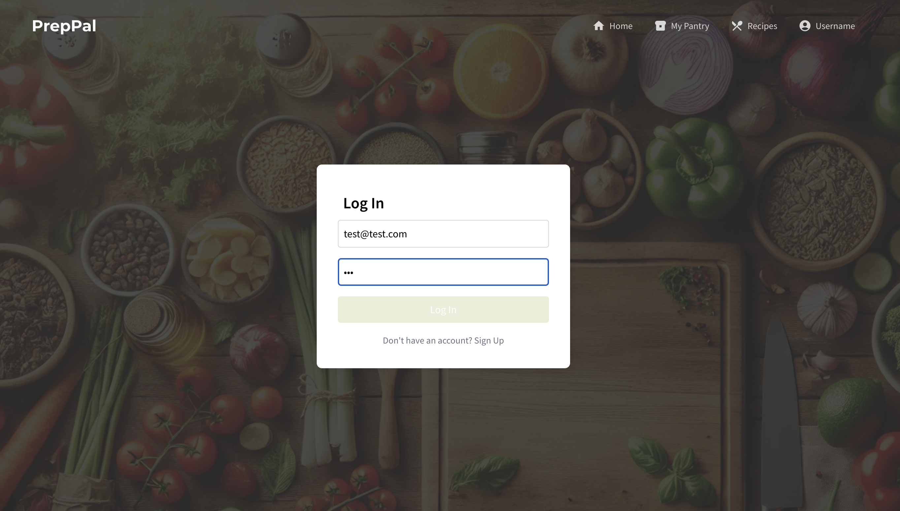

# AC215 PrepPal

### Presentation  Video
- [Youtube] --add link
### Blog Post Link
- [Medium Post] --add link

## Table of Contents
1. [Project Organization](#project-organization)
2. [PrepPal Description](#preppal)
3. [Application Design](#application-design)
4. [Instructions to run our application](#instructions-to-run-our-application)
   - [GCP Setup](#gcp-setup)
   - [Containerized Components](#containerized-components) (follow the links in this section for detailed instructions of how to run each component)
   - [Testing](#testing)
5. [Using the Application](#using-the-application)
6. [CI/CD](#cicd)
7. [Known Issues and Limitations / Future Work](#known-issues-and-limitations--future-work)

## Project Organization

```
├── .github
│   ├──workflows
│   │   ├── CI-push.yml
│   └── └── pre-commit.yml
├── README.md
├── data # DO NOT UPLOAD DATA TO GITHUB, only .gitkeep to keep the directory or a really small sample
├── midterm_presentation
│   └── PrepPalMidterm.pdf
├── assets
│   ├── PrepPal.png
│   ├── VM.png
│   ├── API.png
│   ├── Design
│   │   ├── SolutionArchitecture1.jpg
│   │   ├── SolutionArchitecture2.jpg
│   │   └── TechnicalArchitecture.jpg
│   ├── Frontend
│   │   ├── home.png
│   │   ├── login.png
│   │   ├── pantry.png
│   └── └── recs.png
├── notebooks
│   └── data_cleaning.ipynb
├── references
│   ├── Doub_et_al.pdf
│   └── Lebersorger_Schneider.pdf
├── reports
│   ├── PrepPal_Statement_of_Work.pdf
│   ├── dataversioning.md
│   ├── git_log.png
│   ├── milestone2.md
│   ├── milestone3.md
│   ├── milestone4.md
│   ├── model_evaluation_before_and_after_rag_and_finetuning.pdf
│   ├── finetuning_images
│   │   ├── data_distribution_1.png
│   │   ├── data_distribution_2.png
│   │   ├── training_validation_metric_preppal_v1.png
│   └── └── ml_workflow_success.png
├── src
│   ├── apiservice
│   │   ├── api
│   │   │   ├── routers
│   │   │   │   └── ...
│   │   │   ├── utils
│   │   │   │   └── ...
│   │   │   ├── __init__.py
│   │   │   ├── service_old.py
│   │   │   └── service.py
│   │   ├── tests
│   │   │   └── ...
│   │   ├── .gitignore
│   │   ├── docker-entrypoint.sh
│   │   ├── docker-shell.sh
│   │   ├── Dockerfile
│   │   ├── Pipfile
│   │   ├── Pipfile.lock
│   │   ├── README.md
│   │   └── testing.md
│   ├── data-processor
│   │   ├── cli.py
│   │   ├── docker_entrypoint.sh
│   │   ├── docker-shell.sh
│   │   ├── Dockerfile
│   │   ├── helper.py
│   │   ├── Pipfile
│   │   ├── Pipfile.lock
│   │   └── preprocessor.py
│   ├── dataversioning
│   │   ├── .gitignore
│   │   ├── check_connection.py
│   │   ├── docker_entrypoint.sh
│   │   ├── docker-shell.sh
│   │   ├── Dockerfile
│   │   ├── dvc_store.dvc
│   │   ├── Pipfile
│   │   ├── Pipfile.lock
│   │   ├── check_connection.py
│   │   └── README.md
│   ├── frontend-react
│   │   ├── public
│   │   │   └── ...
│   │   ├── src
│   │   │   ├── app
│   │   │   │   └── ...
│   │   │   ├── components
│   │   │   │   └── ...
│   │   │   │   services
│   │   │   └── └── ...
│   │   ├── tests
│   │   │   └── ...
│   │   ├── .env.development
│   │   ├── .env.production
│   │   ├── .gitignore
│   │   ├── docker-shell.sh
│   │   ├── Dockerfile
│   │   ├── Dockerfile.dev
│   │   ├── jsconfig.json
│   │   ├── next.config.js
│   │   ├── package-lock.json
│   │   ├── package.json
│   │   ├── postcss.config.js
│   │   ├── tailwind.config.js
│   │   ├── README.md
│   │   └── testing.md
│   ├── llm-rag
│   │   ├── .gitignore
│   │   ├── cli.py
│   │   ├── docker-compose.yml
│   │   ├── docker-entrypoint.sh
│   │   ├── docker-shell.sh
│   │   ├── Dockerfile
│   │   ├── Pipfile
│   │   ├── Pipfile.lock
│   │   ├── preprocess_rag.py
│   │   ├── preprocess_recipes.py
│   |   ├── model_rag.py
│   │   └── README.md
│   ├── ml-workflow
│   │   ├── data-processor
│   │   │   └── ...
│   │   ├── model-training
│   │   │   └── ...
│   │   ├── workflow
│   │   └── └── ...
│   ├── llm-finetuning
│   │   ├── dataset_creator
│   │   │   ├── create_fine_tuning_data.py
│   │   │   ├── docker-entrypoint.sh
│   │   │   ├── docker-shell.sh
│   │   │   ├── Dockerfile
│   │   │   ├── Pipfile
│   │   │   └── Pipfile.lock
│   ├── ├── gemini_finetuner
│   │   │   ├── cli.py
│   │   │   ├── docker-entrypoint.sh
│   │   │   ├── docker-shell.sh
│   │   │   ├── Dockerfile
│   │   │   ├── Pipfile
│   │   └── └── Pipfile.lock
│   ├── deployment
│   │   ├── nginx-conf
│   │   │   └── ...
│   │   ├── .docker-tag
│   │   ├── .docker-tag-ml
│   │   ├── .cli.py
│   │   ├── deploy-create-instance.yml
│   │   ├── deploy-docker-images-app.yml
│   │   ├── deploy-docker-images-ml.yml
│   │   ├── deploy-k8s-cluster.yml
│   │   ├── deploy-k8s-update.sh
│   │   ├── deploy-provision-instance.yml
│   │   ├── deploy-setup-containers.yml
│   │   ├── deploy-setup-webserver.yml
│   │   ├── docker-entrypoint.sh
│   │   ├── docker-shell.sh
│   │   ├── Dockerfile
│   │   ├── inventory-prod.yml
│   │   ├── inventory.yml
│   │   ├── model.py
│   │   ├── pipeline.yaml
│   │   ├── Pipfile
│   │   ├── Pipfile.lock
│   │   ├── README.md
│   │   ├── run-data-processor.sh
│   |   ├── run-ml-pipeline.sh
│   │   └── update-k8s-cluster.yml
│   ├── postgres-db
│   │   ├── docker-compose.yml
│   │   ├── Dockerfile
│   │   ├── README.md
│   │   ├── schema.sql
│   └── └── setup.sh
├── .gitignore
├── .pre-commit-config.yaml
├── LICENSE
└── pytest.ini
```

# PrepPal

**Team Members:** <br>
Ioana-Andreea Cristescu, Jonas Raedler, Rosetta Hu, Alice Cheng

**Group Name** <br>
PrepPal

**Project:** <br>
In this project, we aim to develop an AI-powered meal-planning application that streamlines recipe discovery and ingredient management. Powered by a Retrieval-Augmented Generation (RAG) model, the app suggests personalized recipes from a database of 300,000 meals, using available pantry ingredients and user preferences. Users can easily manage their pantry and saved recipes, with the app dynamically adjusting recommendations based on updates. A fine-tuned model enhances the user experience by prioritizing recipes that align with personal tastes and pantry stock, helping reduce food waste and simplify meal preparation.

This repository includes all the components neccessary to deploy a fully functional application on Google Cloud Platform (GCP). Those components include the deployments using Ansible scripts, the frontend, API service, data management, including versioning, and the implemetation of RAG and fine-tuned LLM model.

## Application Design

We've put together a detailed design document outlining the application’s architecture, comprised of a Solution Architecture and Technical Architecture graphic to ensure all our components work together.

**Solution Architecture:**


**Technical Architecture:**


## Instructions to run our application

### **GCP Setup:** <br>

1. Virtual Machine
   - Create a VM Instance from [GCP](https://console.cloud.google.com/compute/instances)
     - Region: us-east4-a (can choose any region that supports the type of machine chosen)
     - Machine Configuration:
       - GPU type: NVIDIA L4
       - Machine Type: g2-standard-4
       - Memory: 200 GB (at least)
     - You can choose a lower tier GPU that runs with 4-8 vCPUs. We had to upgrade to NVIDIA L4 due to unavailability of other GPUs.
   - SSH into your newly created instance
   - Install Docker on the newly created instance by running: `sudo apt install docker.io`
   - Install docker-compose:
     - `sudo curl -L "https://github.com/docker/compose/releases/download/1.29.2/docker-compose-$(uname -s)-$(uname -m)" -o /usr/local/bin/docker-compose`
     - `chmod +x /usr/local/bin/docker-compose`
     - To test your installation of Compose, run the following command: `docker-compose --version`
   - Install Git: sudo apt install git
   - Clone App Repo: git clone https://github.com/acheng257/ac215_PrepPal.git


2. GCP Bucket
   - Navigate to Storage > [Buckets](https://console.cloud.google.com/storage/browser) and click create bucket
     - Name: any unique bucket name
     - Region: us-east1
   - Create a folder `dvc_store` inside the bucket for data versioning using dvc
   - Create other folders inside the bucket to store data
3. GCP Bucket Service Account
   - Navigate to IAM & Admin > [Service Accounts](https://console.cloud.google.com/iam-admin/serviceaccounts)
   - Click + Create Service Account
   - Name the service account and click Create and Continue.
   - Assign a role with the premission to access the GCS Bucket above:
     - Storage Admin (full access to the bucket)
   - Click on the service account and navigate to the tab "KEYS"
   - Click in the button "ADD Key (Create New Key)" and Select "JSON". This will download a private key JSON file.
   - Create a local **secrets** folder
     ```
          |-ac215_Preppal
          |-secrets
     ```
   - Copy the above key JSON file into the secrets folder and rename it to `data-service-account.json`
4. Vertex AI API Service Account
   - Navigate to IAM & Admin > [Service Accounts](https://console.cloud.google.com/iam-admin/serviceaccounts)
   - Click + Create Service Account
   - Name the service account and click Create and Continue.
   - Assign a role with the premission to access the GCS Bucket above:
     - Storage Admin
     - Vertex AI User
   - Click on the service account and navigate to the tab "KEYS"
   - Click in the button "ADD Key (Create New Key)" and Select "JSON". This will download a private key JSON file.
   - Copy the above key JSON file into the secrets folder created in the previous step and rename it to `preppal-llm-service-account.json`

### **Containerized Components:** <br>

1. [Data Versioning Container](./src/dataversioning/README.md)
   - The DVC container sets up version control using open-source DVC (Data Version Control) to efficiently manage data versions. The pipeline connects to Google Cloud Storage (GCS) and mounts a GCS bucket to a local directory. Additionally, it binds this mounted directory to another path to serve as the storage location for DVC-managed data. This setup allows us to seamlessly track, version, and manage large datasets that are stored in the cloud.
2. [LLM RAG System Containers](./src/llm-rag/README.md)
   - The RAG Data Pipeline includes two integrated containers: one for the data pipeline and another for ChromaDB. The data pipeline container manages tasks such as cleaning, chunking, embedding, and integrating data into the vector database, while the ChromaDB container hosts the vector database. RAG allows efficient retrieval of relevant information from the knowledge base, with the capability to dynamically process and add user-uploaded data without altering the pre-existing knowledge base. This ensures flexibility while maintaining the integrity of the original data.
3. [LLM Fine-Tuning Containers](./src/llm-finetuning/README.md)
   - The LLM Fine-Tuning folder includes two containers: one for the generation, preparation, and upload of the fine-tuning dataset, the other for the actual fine-tuning of the Gemini model. The Gemini model is fine-tuned to rank provided recipes based on available ingredients in a pantry. The process begins with generating a fine-tuning dataset using a large recipe collection from the All-Recipes Dataset, then cleaning and preparing it for use. The generated dataset is then uploaded to a GCP bucket, so that it is available for the actual fine-tuning process. Once fine-tuned, the model is able to answer questions by ranking recipes and identifying missing ingredients, providing a structured output for easy further computations. The folder includes scripts for generating, preparing, and uploading data, as well as running the fine-tuning and testing the model interactively.
4. [Frontend Container](./src/frontend-react/README.md)
   - A user friendly React app was built to provide a virtual pantry management system and a recipe recommendation system for users. Users can upload ingredients via text input and query our service for recipe recommendations, and then interact with a chatbot for further customizations and questions. The frontend interacts with backend APIs via axios, connecting to the RAG pipeline, LLM fine-tuning model, and user services for dynamic and real-time data exchange.
5. [API Container](./src/apiservice/README.md)
   - The backend API is implemented using FastAPI, serving as the central orchestrator for managing user interactions and services. It provides endpoints to handle user authentication, pantry management, chat interactions, and recipe recommendations. The API is designed to be scalable and responsive, enabling seamless integration with other components like the frontend, RAG pipeline, and fine-tuned LLM.
6. [PostgreSQL Container](./src/postgres-db/README.md)
   - The PostgreSQL container provides the backend database for the PrepPal application, managing all data related to users, recipes, pantries, and user preferences. It features a structured schema with optimized indexing to ensure efficient querying and scalability. Key tables include users for authentication, pantry for tracking inventory, recipes for storing detailed meal data, and user_history for maintaining personalized session data. The same schema is utilized in the production environment, ensuring consistency across development and deployment. The container is designed for easy setup and local development, with scripts to build and run the database in a Dockerized environment.
7. [Deployment Container](./src/deployment/README.md)
   - The deployment container automates the process of deploying the PrepPal application to Google Cloud Platform (GCP) using Ansible playbooks. It handles tasks such as building and pushing Docker containers to Google Container Registry (GCR), creating and provisioning Compute Engine instances, and setting up web servers and Kubernetes clusters for scalable deployments. The container streamlines resource management, including configuring SSH access, managing GCP service accounts, and deploying ML workflows to Vertex AI pipelines. With this container, the entire infrastructure setup is simplified, ensuring a reliable and production-ready environment for the application.

### **Notebooks/Reports:** <br>
These folders contains code that is not part of any container - for e.g: Application mockup, EDA, crucial insights, reports or visualizations.

### Testing
Our application includes comprehensive tests for both the API and the frontend, covering unit and integration testing. Detailed instructions for running these tests locally can be found in the following files: [Frontend Testing](./src/frontend-react/testing.md) and [API Testing](./src/apiservice/testing.md).

Our test suite achieves 80% coverage, ensuring that the core functionality of the application is thoroughly validated. However, modules such as fine-tuning the LLM or running test embeddings are not included in automated testing, as these processes are not typically suited to standard testing methods. For these, we provide detailed performance metrics in the `reports` folder and conduct manual testing to ensure reliability. These tests are automatically executed through GitHub Actions, maintaining continuous integration and consistent validation of the codebase.

## Using the Application
After deploying the PrepPal application locally or in a production environment, you can begin interacting with its features to streamline meal planning and pantry management. This section provides a step-by-step guide on how to use the application, complete with examples and visuals to help you get started.

From signing up and managing your pantry to receiving personalized recipe recommendations and uploading your own recipes, this guide covers all key functionalities of PrepPal. Follow the steps below to make the most of your experience:

1. **Sign up / Log in**

   To start using the PrepPal application, create a new account by filling out the required details on the Sign-Up page, including your first name, last name, username, phone number, and password. If you already have an account, navigate to the Log-In page and enter your credentials to access your dashboard. These steps allow you to securely authenticate and begin managing your pantry and exploring recipe recommendations.

   
   

2. **Update your pantry**

   The Pantry page allows you to manage your inventory by adding, editing, or deleting ingredients. Use the input field to add new ingredients in a comma-separated format (e.g., "apple 3, onion 2") and click "Submit" to update your pantry. You can also adjust the quantity of existing items using the "+" or "-" buttons or remove items entirely. This feature ensures your pantry stays up-to-date for accurate recipe recommendations.

   

3. **Ask for recommendations**

   The Recipe Recommendations page lets you explore meal ideas tailored to your pantry and preferences:

   - **Ingredient-Based Recommendations:** Enter a comma-separated list of ingredients in the input field and click "Submit" to receive five recipe suggestions from a database of 300,000 meals. These recommendations maximize the use of your specified ingredients and pantry items, helping to minimize food waste. Each recipe includes a list of missing ingredients, so you can easily identify what additional items are needed. You can also click on any suggested recipe to view more details, including full instructions, ingredient breakdowns, and nutritional information.

   - **Chat Functionality:** Use the chat interface to interact with an AI-powered assistant. Simply type your queries in the chat box below the recommendations and hit "Send." You can request modifications to the recommended recipes, ask for ingredient substitutions, cooking tips, or even new recipe ideas not available in the database. This feature ensures a highly personalized and interactive cooking experience.

   

4. **Use / Favor recipe**

   Once you click on a recipe to view more details, you have two key actions available:

   - **Use this recipe:** Clicking this button automatically updates your pantry by subtracting the required ingredients from your inventory. For example, if the recipe calls for 2 tomatoes and you have 5 in your pantry, your pantry will update to reflect 3 tomatoes remaining. Basic pantry staples like salt, pepper, and oil are not deducted, as they are considered essentials that are not typically tracked in detail.

   - **Add to Favorites:** Clicking this button saves the recipe to your favorites, making it easily accessible under the "Your Recipes" tab for quick reference the next time you want to cook it.

   

5. **Your recipes**

   The "Your Recipes" page allows you to manage and access all your saved recipes. Here, you can view your favorite recipes that you’ve added for easy access, as well as the recipes you’ve uploaded to the app. Additionally, you can upload new recipes by selecting a file and clicking the "Upload Recipe" button, expanding your collection of personalized meal ideas. This page serves as your central hub for all your go-to and custom recipes.

   

6. **Home page**

   The Home Page welcomes you to PrepPal with a personalized greeting and highlights the app's mission to reduce food waste with creative recipes. From here, you can easily navigate to other sections of the app, including your pantry, recipe recommendations, and favorite recipes. The "Logout" button allows you to securely exit the app when you're done.

   

## CI/CD

## Known Issues and Limitations / Future Work and Enhancements
### Pantry Updates
Currently, the pantry updates take in a string containing the item name and a number representing the quantity. Measurements for the quantity are not supported, so we would want to incorporate some sort of automatic conversion so that quantities of each ingredient are associated with measurement units.

Furthermore, we are using an LLM to perform updates to the pantry when a user uses a recipe. However, this is not deterministic and sometimes does not work if the ingredient name doesn't match closely to the name of the item in the pantry; for instance, the LLM does not always identify "russet potatoes" and "potato" as a match.

### Recipe Measurements
Currently, we enhance the recipe data in our LLM RAG database by using a fine-tuned LLM to generate units for the ingredients list, as the original recipe did not contain units. This process has to be re-done each time the application is rebooted, but in the future we would pass the recipes through the LLM once and then embed the results of the enhanced recipes and save those to the database so that this process only has to be completed once.

### User Preferences
Our application allows users to upload their own recipes as a text file and adds it to a data table in PostgreSQL. We would need to load these recipes into the LLM RAG database and pass each user's uploaded recipes as context to our recommendation system so that the recommendations become more personalized. However, this would involve re-training of the model with the additional recipes.
