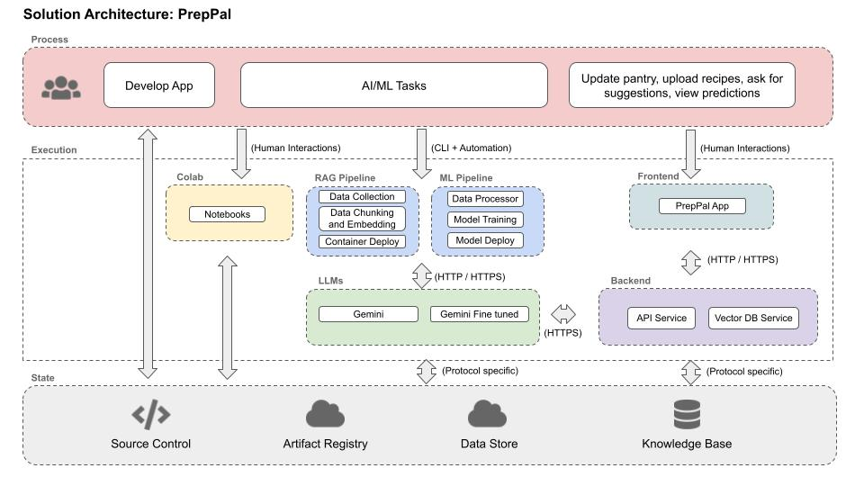

## AC215 PrepPal - Milestone 3

#### Project Milestone 3 Organization

```
├── README.md
├── data # DO NOT UPLOAD DATA TO GITHUB, only .gitkeep to keep the directory or a really small sample
├── midterm_presentation
│   └── PrepPalMidterm.pdf
├── assets
│   ├── PrepPal.png
│   └── VM.png
├── notebooks
│   └── data_cleaning.ipynb
├── references
│   ├── Doub_et_al.pdf
│   └── Lebersorger_Schneider.pdf
├── reports
│   ├── PrepPal_Statement_of_Work.pdf
│   ├── dataversioning.md
│   ├── git_log.png
│   ├── model_evaluation_before_and_after_rag_and_finetuning.pdf
│   ├── finetuning_images
│   │   ├── data_distribution_1.png
│   │   ├── data_distribution_2.png
│   └── └── training_validation_metric_preppal_v1.png
└── src
    ├── dataversioning
    │   ├── docker_entrypoint.sh
    │   ├── docker-shell.sh
    │   ├── Dockerfile
    │   ├── dvc_store.dvc
    │   ├── Pipfile
    │   ├── Pipfile.lock
    │   ├── test_connection.py
    │   └── README.md
    ├── llm-rag
    │   ├── cli.py
    │   ├── docker-compose.yml
    │   ├── docker-entrypoint.sh
    │   ├── docker-shell.sh
    │   ├── Dockerfile
    │   ├── Pipfile
    │   ├── Pipfile.lock
    │   ├── preprocess_rag.py
    │   ├── preprocess_recipes.py
    |   ├── model_rag.py
    │   └── README.md
    ├── llm-finetuning
    │   ├── dataset_creator
    │   │   ├── create_fine_tuning_data.py
    │   │   ├── docker-entrypoint.sh
    │   │   ├── docker-shell.sh
    │   │   ├── Dockerfile
    │   │   ├── Pipfile
    └── └── └── Pipfile.lock
    ├── ├── gemini_finetuner
    │   │   ├── cli.py
    │   │   ├── docker-entrypoint.sh
    │   │   ├── docker-shell.sh
    │   │   ├── Dockerfile
    │   │   ├── Pipfile
    └── └── └── Pipfile.lock
```

# AC215 - Milestone4 - PrepPal

**Team Members:** <br>
Ioana-Andreea Cristescu, Jonas Raedler, Rosetta Hu, Alice Cheng

**Group Name** <br>
PrepPal

**Project:** <br>
In this project, we aim to develop an AI-powered meal-planning application that streamlines recipe discovery and ingredient management. Powered by a Retrieval-Augmented Generation (RAG) model, the app suggests personalized recipes from a database of 300,000 meals, using available pantry ingredients and user preferences. Users can easily manage their pantry and saved recipes, with the app dynamically adjusting recommendations based on updates. A fine-tuned model enhances the user experience by prioritizing recipes that align with personal tastes and pantry stock, helping reduce food waste and simplify meal preparation.

### Milestone4 ###

In this milestone, we have the components for frontend, API service, also components from previous milestones for data management, including versioning, as well as the implemetation of RAG and fine-tuned LLM model.

After completions of building a robust ML Pipeline in our previous milestone we have built a backend api service and frontend app. This will be our user-facing application that ties together the various components built in previous milestones.

**Application Design**

Before we start implementing the app we built a detailed design document outlining the application’s architecture. We built a Solution Architecture and Technical Architecture to ensure all our components work together.

Here is our Solution Architecture:




Here is our Technical Architecture:


**Backend API**

We built backend api service using fast API to expose model functionality to the frontend. We also added apis that will help the frontend display some key information about the model and data.

```Add screenshots here```

**Frontend**

A user friendly React app was built to identify various species of mushrooms in the wild using computer vision models from the backend. Using the app a user can take a picture of a mushroom and upload it. The app will send the image to the backend api to get prediction results on weather the mushroom is poisonous or not.

Here are some screenshots of our app:

```Add screenshots here```


### Instructions to run our application

**GCP Setup:** <br>

1. Virtual Machine
   - Create a VM Instance from [GCP](https://console.cloud.google.com/compute/instances)
     - Region: us-east4-a (can choose any region that supports the type of machine chosen)
     - Machine Configuration:
       - GPU type: NVIDIA T4
       - Machine Type: g2-standard-4
       - Memory: 200 GB (at least)
     - You can choose a lower tier GPU that runs with 4-8 vCPUs. We had to upgrade to NVIDIA L4 due to unavailability of other GPUs.
   - SSH into your newly created instance
   - Install Docker on the newly created instance by running: `sudo apt install docker.io`
   - Install docker-compose:
     - `sudo curl -L "https://github.com/docker/compose/releases/download/1.29.2/docker-compose-$(uname -s)-$(uname -m)" -o /usr/local/bin/docker-compose`
     - `chmod +x /usr/local/bin/docker-compose`
     - To test your installation of Compose, run the following command: `docker-compose --version`
   - Install Git: sudo apt install git
   - Clone App Repo: git clone https://github.com/acheng257/ac215_PrepPal.git


2. GCP Bucket
   - Navigate to Storage > [Buckets](https://console.cloud.google.com/storage/browser) and click create bucket
     - Name: any unique bucket name
     - Region: us-east1
   - Create a folder `dvc_store` inside the bucket for data versioning using dvc
   - Create other folders inside the bucket to store data
3. GCP Bucket Service Account
   - Navigate to IAM & Admin > [Service Accounts](https://console.cloud.google.com/iam-admin/serviceaccounts)
   - Click + Create Service Account
   - Name the service account and click Create and Continue.
   - Assign a role with the premission to access the GCS Bucket above:
     - Storage Admin (full access to the bucket)
   - Click on the service account and navigate to the tab "KEYS"
   - Click in the button "ADD Key (Create New Key)" and Select "JSON". This will download a private key JSON file.
   - Create a local **secrets** folder
     ```
          |-ac215_Preppal
          |-secrets
     ```
   - Copy the above key JSON file into the secrets folder and rename it to `data-service-account.json`
4. Vertex AI API Service Account
   - Navigate to IAM & Admin > [Service Accounts](https://console.cloud.google.com/iam-admin/serviceaccounts)
   - Click + Create Service Account
   - Name the service account and click Create and Continue.
   - Assign a role with the premission to access the GCS Bucket above:
     - Storage Admin
     - Vertex AI User
   - Click on the service account and navigate to the tab "KEYS"
   - Click in the button "ADD Key (Create New Key)" and Select "JSON". This will download a private key JSON file.
   - Copy the above key JSON file into the secrets folder created in the previous step and rename it to `preppal-llm-service-account.json`

**Containerized Components:** <br>

1. [Data Versioning Container](./src/dataversioning/README.md)
   - The DVC container sets up version control using open-source DVC (Data Version Control) to efficiently manage data versions. The pipeline connects to Google Cloud Storage (GCS) and mounts a GCS bucket to a local directory. Additionally, it binds this mounted directory to another path to serve as the storage location for DVC-managed data. This setup allows us to seamlessly track, version, and manage large datasets that are stored in the cloud.
2. [LLM RAG System Containers](./src/llm-rag/README.md)
   - The RAG Data Pipeline includes two integrated containers: one for the data pipeline and another for ChromaDB. The data pipeline container manages tasks such as cleaning, chunking, embedding, and integrating data into the vector database, while the ChromaDB container hosts the vector database. RAG allows efficient retrieval of relevant information from the knowledge base, with the capability to dynamically process and add user-uploaded data without altering the pre-existing knowledge base. This ensures flexibility while maintaining the integrity of the original data.
3. [LLM Fine-Tuning Containers](./src/llm-finetuning/README.md)
   - The LLM Fine-Tuning folder includes two containers: one for the generation, preparation, and upload of the fine-tuning dataset, the other for the actual fine-tuning of the Gemini model. The Gemini model is fine-tuned to rank provided recipes based on available ingredients in a pantry. The process begins with generating a fine-tuning dataset using a large recipe collection from the All-Recipes Dataset, then cleaning and preparing it for use. The generated dataset is then uploaded to a GCP bucket, so that it is available for the actual fine-tuning process. Once fine-tuned, the model is able to answer questions by ranking recipes and identifying missing ingredients, providing a structured output for easy further computations. The folder includes scripts for generating, preparing, and uploading data, as well as running the fine-tuning and testing the model interactively.
4. [Frontend Container]
5. [API Container](./src/apiservice/README.md)

**Notebooks/Reports:** <br>
These folders contains code that is not part of any container - for e.g: Application mockup, EDA, crucial insights, reports or visualizations.

### Application Mock-up


