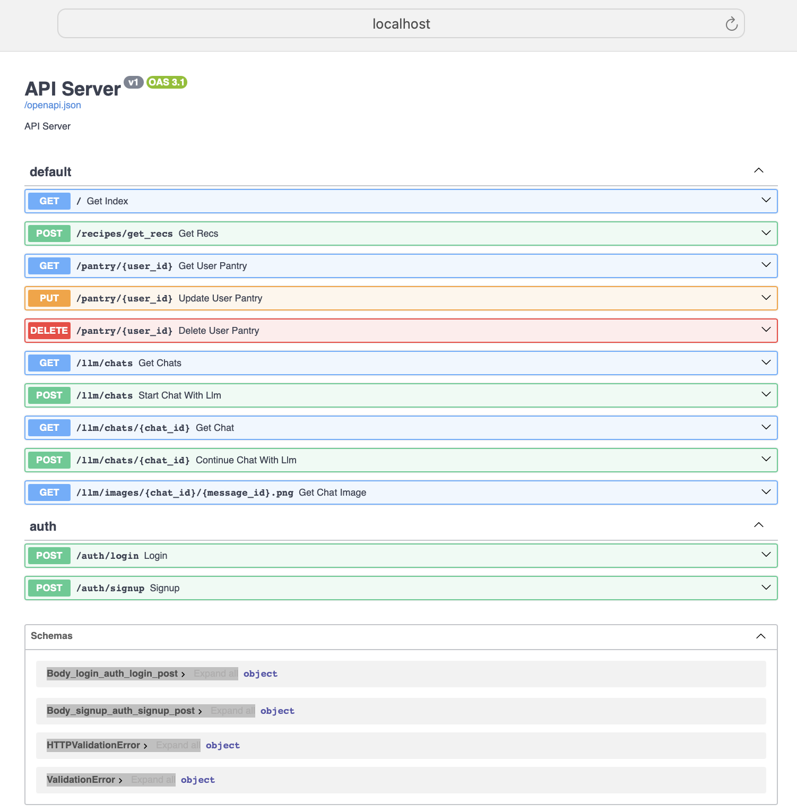

# API Service

## Backend API Container

Build with FastAPI framework

### Go into the api-service folder

- Open a terminal and go to `src/apiservice`

### Build & Run Container

- Run `sh docker-shell.sh`

### Start API Service

- To run development API service run `uvicorn_server` from the docker shell

- Test the API service by going to `http://localhost:9000/`

### Endpoints

| **Endpoint**                             | **Method** | **Description**                                                                       | **Request Headers**  | **Request Body**                                                 | **Response**                              |
| ---------------------------------------- | ---------- | ------------------------------------------------------------------------------------- | -------------------- | ---------------------------------------------------------------- | ----------------------------------------- |
| `/auth/login`                            | POST       | Authenticates a user by verifying their username and password.                        | None                 | Form: `username` (str), `password` (str)                         | Confirmation of login success or failure  |
| `/auth/signup`                           | POST       | Creates a new user account in the database.                                           | None                 | Form: `username` (str), `password` (str)                         | Confirmation of signup success or failure |
| `/llm/chats`                             | GET        | Retrieves all chats for the user, optionally limited by a specified number.           | `X-Session-ID` (str) | None                                                             | List of chats with metadata.              |
| `/llm/chats/{chat_id}`                   | GET        | Fetches a specific chat by its unique ID.                                             | `X-Session-ID` (str) | None                                                             | The chat with its messages.               |
| `/llm/chats`                             | POST       | Initiates a new chat with an initial message.                                         | `X-Session-ID` (str) | JSON: `content` (str), `recommendations` (list), `pantry` (list) | Newly created chat session.               |
| `/llm/chats/{chat_id}`                   | POST       | Adds a new message to an existing chat.                                               | `X-Session-ID` (str) | JSON: `content` (str)                                            | Updated chat with assistant's response.   |
| `/llm/images/{chat_id}/{message_id}.png` | GET        | Serves an image associated with a specific chat message.                              | None                 | None                                                             | Image file or error if not found.         |
| `/pantry/{user_id}`                      | GET        | Retrieves the pantry data for a user. Creates a default pantry if one does not exist. | None                 | None                                                             | User's pantry data.                       |
| `/pantry/{user_id}`                      | PUT        | Updates or creates pantry data for a user.                                            | None                 | JSON: Pantry data in key-value pairs                             | Confirmation of update                    |
| `/pantry/{user_id}`                      | DELETE     | Deletes the pantry data for a user.                                                   | None                 | None                                                             | Confirmation of deletion:                 |
| `/recipes/get_recs`                      | POST       | Generates recipe recommendations based on ingredients and pantry data.                | None                 | JSON: `ingredients` (list)                                       | List of recommended recipes               |

### Testing

- Refer to this [file](testing.md) for instructions of how to manually run the unit tests for the API functionality.
