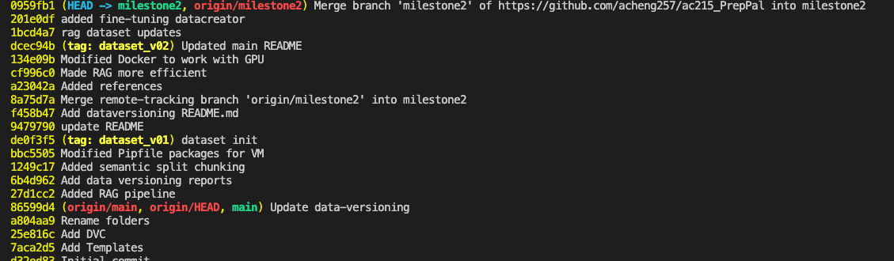

# Dataversioning

This project uses DVC (Data Version Control) to manage data throughout the development lifecycle. The details of our reasoning can be found [here](https://github.com/acheng257/ac215_PrepPal/blob/milestone2/reports/dataversioning.md).

## Prerequisites

- Have the latest Docker installed
- Cloned repository from [here](https://github.com/acheng257/ac215_PrepPal) to local machine

#### 1. Run `docker-shell.sh`

- Inside the `data-versioning` folder
- Run `sh docker-shell.sh`

#### 2. Add the Dataset (Changes) to Registry

`dvc add dvc_store`

#### 3. Push to Remote Registry

`dvc push`

#### 4. Update Git to Rrack DVC changes (Outside the Container)

- First run git status `git status`
- Add changes `git add .`
- Commit changes `git commit -m 'dataset updates...'`
- Add a dataset tag `git tag -a 'dataset_v{#}' -m 'rag dataset'`
- Push changes `git push --atomic origin main dataset_v{#}`

#### 5. Retrieve Data (Inside the Container)

`dvc pull`

#### Look at Past Versions

`git log --oneline`

  
Click to see an example log

  

