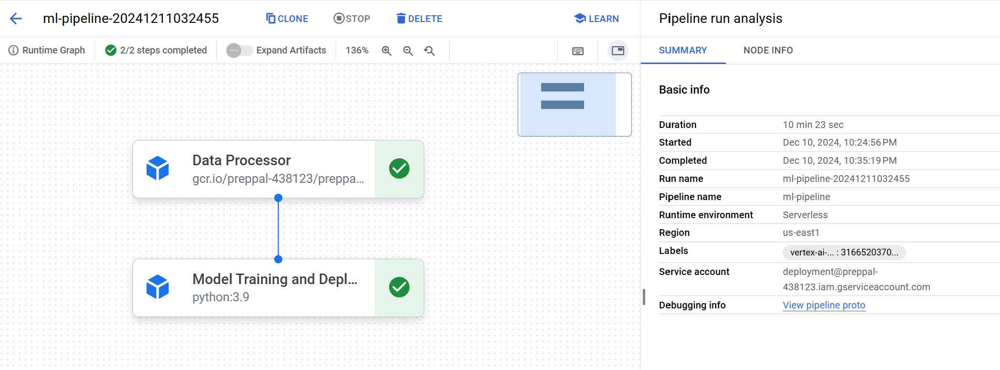

# Deployment & Scaling

## App Deployment to GCP - Ansible
Follow the steps below to deploy the PrepPal App to GCP. Using Ansible playbooks, we automate building and pushing our Docker containers to GCR (Google Container Registry), creating a Compute Instance (VM) Server in GCP, provisioning the VM, setting up the docker containers in the VM, and a webserver.

### API's to enable in GCP
Search for each of these in the GCP search bar and click enable to enable these API's:

- Vertex AI API
- Compute Engine API
- Service Usage API
- Cloud Resource Manager API
- Google Container Registry API
- Kubernetes Engine API

### Setup GCP Service Accounts for deployment
Follow these steps to setup the 2 service accounts needed to run the application in a production environment.
- To setup a new service account you will need to go to [GCP Console](https://console.cloud.google.com/home/dashboard), search for  "Service accounts" from the top search box. or go to: "IAM & Admins" > "Service accounts" from the top-left menu and create a new service account called "deployment".
- Name the first service "deployment" and give it the following roles:
    - Compute Admin
    - Compute OS Login
    - Container Registry Service Agent
    - Kubernetes Engine Admin
    - Service Account User
    - Storage Admin
    - Vertex AI Administrator
    - Artifact Registry Administrator
- Click done (this will create a service account)
- On the right "Actions" column click the vertical ... and select "Create key". A prompt for Create private key for "deployment" will appear select "JSON" and click create. This will download a Private key json file to your computer. Copy this json file into the **secrets** folder. Rename the json key file to `deployment.json`
- Follow the same process Create another service account called `gcp-service` and give it the following roles:
    - Storage Object Viewer
    - Vertex AI Administrator
- Rename the json key file to `gcp-service.json`

### Run `deployment` container
- cd into the `deployment` folder
- Go into `docker-shell.sh` and change `GCP_PROJECT`, `GCP_ZONE`, `GCP_REGION` to the ones corresponding to your project
- Check versions of tools:
```
gcloud --version
ansible --version
kubectl version --client
```
- Check to make sure you are authenticated to GCP: `gcloud auth list`

Now you have a Docker container that connects to your GCP and can create VMs, deploy containers all from the command line.

### SSH Setup
#### Configuring OS Login for service account
- Run this within the `deployment` container
```
gcloud compute project-info add-metadata --project <YOUR GCP_PROJECT> --metadata enable-oslogin=TRUE
```

#### Create SSH key for service account
```
cd /secrets
ssh-keygen -f ssh-key-deployment
cd /app
```

#### Providing public SSH keys to instances
```
gcloud compute os-login ssh-keys add --key-file=/secrets/ssh-key-deployment.pub
```
From the output of the above command keep note of the username. Here is a snippet of the output
```
- accountId: preppal
    gid: '3906553998'
    homeDirectory: /home/sa_100110341521630214262
    name: users/deployment@preppal.iam.gserviceaccount.com/projects/preppal
    operatingSystemType: LINUX
    primary: true
    uid: '3906553998'
	...
    username: sa_100110341521630214262
```
The username is `sa_100110341521630214262`

### Deployment Setup
* Add ansible user details in inventory.yml file
* GCP project details in inventory.yml file
* GCP Compute instance details in inventory.yml file

### Deployment
- Build and Push Docker Containers to GCR (Google Container Registry): `ansible-playbook deploy-docker-images-app.yml -i inventory.yml`
- Create Compute Instance (VM) Server in GCP: `ansible-playbook deploy-create-instance.yml -i inventory.yml --extra-vars cluster_state=present`
- Once the command runs successfully get the IP address of the compute instance from GCP Console and update the appserver>hosts in inventory.yml file
- Provision Compute Instance in GCP: `ansible-playbook deploy-provision-instance.yml -i inventory.yml`
- Setup Docker Containers in the Compute Instance: `ansible-playbook deploy-setup-containers.yml -i inventory.yml`
- Setup Webserver on the Compute Instance: `ansible-playbook deploy-setup-webserver.yml -i inventory.yml`

### View the App
- Copy the VM IP from the terminal
- Go to `http://<External IP>/` to see your application

### Delete the Compute Instance / Persistent disk
- Run this command to delete all resources allocated in GCP: `ansible-playbook deploy-create-instance.yml -i inventory.yml --extra-vars cluster_state=absent`

## App Deployment to GCP - Ansible + Kubernetes
Follow the steps below to deploy the PrepPal App to GCP. Using Ansible playbooks, we automate building and pushing our Docker containers to GCR (Google Container Registry) and creating a Kubernetes cluster to host the application.

### Setup
If you haven't done it already, start by following the steps described in the following sections in the given order:

- [API's to enable in GCP](#apis-to-enable-in-gcp)
- [Setup GCP Service Accounts for deployment](#setup-gcp-service-accounts-for-deployment)
- [Run `deployment` container](#run-deployment-container)

### Build and Push Docker Containers to GCR
Follow this step only if you have NOT already done this: `ansible-playbook deploy-docker-images.yml -i inventory.yml`

### Create & Deploy Cluster
Run the following command to create, deploy the cluster, and start all the Docker containers: `ansible-playbook deploy-docker-images.yml -i inventory.yml`

### View the App
- Copy the `nginx_ingress_ip` from the terminal from the create cluster command
- Go to `http://<YOUR INGRESS IP>.sslip.io`

### Delete Cluster
- Run this command to delete all resources allocated in GCP: `ansible-playbook deploy-k8s-cluster.yml -i inventory.yml --extra-vars cluster_state=absent`

## ML Workflow
This container also contains the ML workflow functionality, meaning that it allows for an automatic data-preprocessing, training-dataset-creation, model fine-tuning, and model deployment process. This ML workflow pipeline can be started in the shell the following way:

- Ensure that you are in `src/deployment`
- Run `sh docker-shell.sh`
- Run `python cli.py --pipeline`

This will submit the pipeline, defined by the data-processor job followed by the model-training-and-deployment job, to Vertex AI. (If you just want to run the data-processor on Vertex AI, you can run `python cli.py --data_processor`). The data-processor job is defined in more detail in `src/data-processor`. After the data-processor has finished on Vertex AI, the pipeline starts the Model Training and Deployment job that runs a supervised tuning job (also executed on Vertex AI) using the data created by the data-processor job. Once that supervised tuning job has completed, the fine-tuned model is automatically uploaded to Vertex AI's model registry and deployed to Model Endpoints.

An example of how this successfully executed pipeline looks like:

