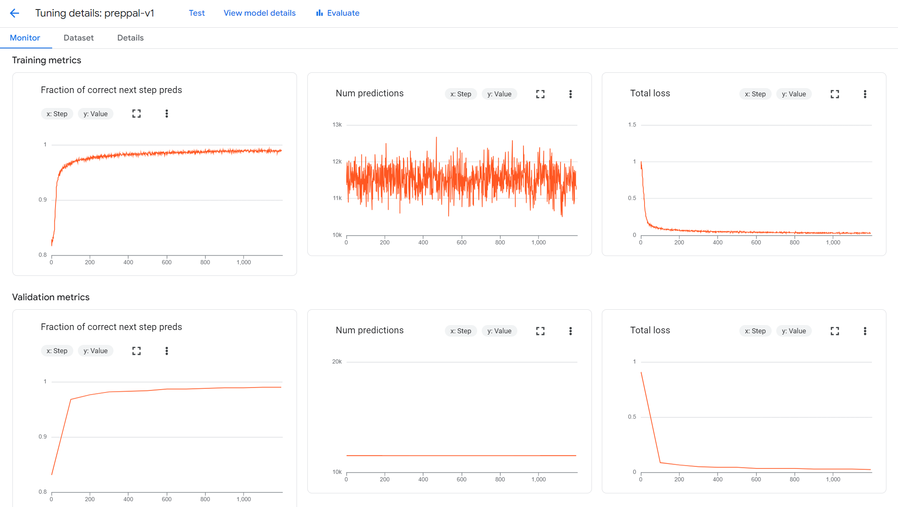
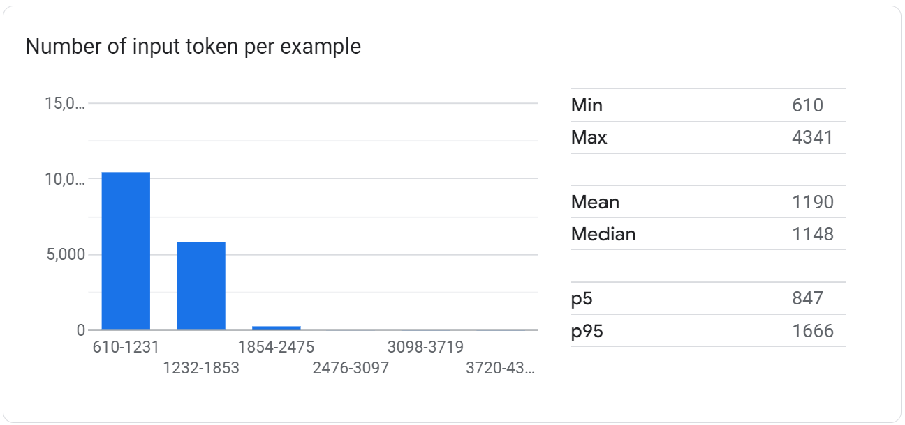
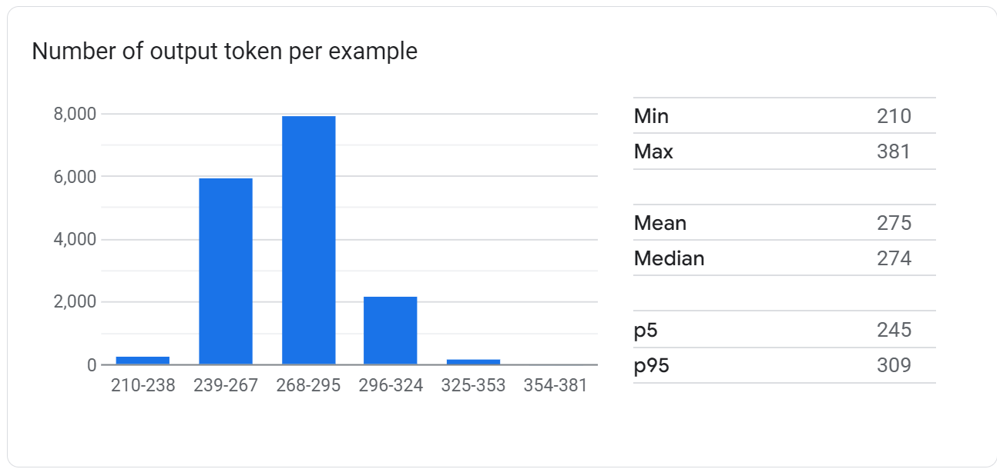

# LLM Fine-tuning
<br>

This part of the application is where our LLM of choice (`gemini-1.5-flash-002`) is fine-tuned. This includes 
- the generation of a dataset for fine-tuning
- fine-tuning the Gemini model

## Data 
Our goal for the fine-tuned LLM was for it to be able to rank recipes based on ingredients available in some pantry. Thus, rather than optimizing it to be particularly verbose and great in a conversation, we wanted it to be able to take natural language (i.e. a collection of recipes) as input, and return a clearly structured and uniformly formatted output, in which the recipes are ranked based on the fit with the ingredients available. This will then allow us to use this output for further (and easier, due to the uniform format) calculation.

This presented us with several challenges: 
- we needed a large collection of recipes
- we needed a reasonable pantry (just random ingredients would not have been particularly useful, as we wanted to fine-tune the LLM to pick the best recipes based on ingredient fit. If a pantry only contains very specific ingredients, there often will be no or only very little fit.)
- we needed a ranking algorithm given some recipes so that we could fine-tune the LLM for our specific task

### Collection of Recipes
For the large collection of recipes, we used the [All-Recipes Dataset](https://huggingface.co/datasets/corbt/all-recipes) available through HuggingFace. This dataset contains 2,231,142 recipes with their respective titles, their ingredients (and their quantities), and their cooking directions. After cleaning (dropping all recipes that contain weird characters, as well as all recipes that contain ingredients that occur less than 501 times), we were left with 1,297,716 recipes. Both the original dataset (full_dataset.csv) and the cleaned version (reduced_dataset.csv) have been stored in a private GCP (Google Cloud Platform) data bucket. All of this has been performed in the notebook explore_finetuning_data.ipynb.

### Reasonable Pantry
Given the cleaned dataset, we computed an ingredient-frequency dictionary and used a weighted-sampling algorithm (using the frequencies as weights) to sample 35 non-reccuring ingredients. This is the random pantry we used in each fine-tuning datapoint (each fine-tuning datapoint had a different random pantry).

### Ranking Algorithm
We had two goals for ranking a collection of recipes. First, we wanted to make sure that recipes are prioritized for which the user already has most of the ingredients in their pantry. Secondly, we wanted to make sure that recipes are prioritized for which the user would have to buy as little new ingredients as possible. We used a balanced approach and tried to balance these two different metrics evenly. For the exact implementation, please see the **`sort_recipes()`** method in **`src/llm-finetuning/dataset_creator/create_finetuning_data.py`**.


## Basic Rundown (TL;DR)
- Make sure you are inside the `src/llm-finetuning/dataset_creator` folder and open a terminal at this location
- Run `sh docker-shell.sh`

Once in the container, generate, prepare, and upload the dataset to the GCP bucket
- Run `python create_fine_tuning_data.py --generate`
- Run `python create_fine_tuning_data.py --prepare`
- Run `python create_fine_tuning_data.py --upload`

Now, exit the container and switch to the `src/llm-finetuning/gemini_finetuner` folder
- Run `sh docker-shell.sh`

Once in the cointainer, fine-tune the model and chat with it for testing purposes
- Run `python cli.py --train`
- Run `python cli.py --chat`

More detailed breakdowns are provided below.


## Generate Question Answer Dataset
*Note: this section is to large parts copied from https://github.com/dlops-io/llm-finetuning/blob/main/README.md*


### Run Container
Run the startup script which makes building & running the container easy.

- Make sure you are inside the `src/llm-finetuning/dataset_creator` folder and open a terminal at this location
- Run `sh docker-shell.sh`

### Generate Text
- Run `python create_fine_tuning_data.py --generate` to generate the fine-tuning QA dataset


#### Number of Iterations for Question Generation

Change the number of iterations to build a larger/smaller dataset. It will cost approximately $1.0 for 34 iterations (if trained for 3 epochs).
```
NUM_ITERATIONS = 34
```
*Note: we were very stupid and fine-tuned for 20.000 iterations the first time. Yes, I regret all the choices I made, and yes, my $300 of credits are gone now. However, our fine-tuned model is **definitely** fine-tuned now :)*


### Sample Question Answers

As mentioned earlier, every question will include the ingredients available in the user's pantry and a certain number of recipes (we chose 5 per question), followed by the question: `Based on the items in my pantry, how would you rank these recipes? I want to use as many ingredients from my pantry as possible.`. Every answer will be the ranking of the recipes, followed by which ingredients the user is missing for that specific recipe.

Here is one sample result from when you run the `--generate` option from the above step:

```
[
  {
    "question": "Here are the ingredients you have available in your pantry: salt, sugar, water, olive oil, pepper, cornmeal, lime juice, white wine vinegar, flour, fresh mint, garlic, apples, portobello mushrooms, eggs, tomatoes, vanilla pudding, cream cheese, green tomatoes, potatoes, oats, vanilla, nuts, bean sprouts, popcorn, chili powder, mozzarella cheese, tabasco sauce, baking soda, onion, mustard, bread crumbs, light brown sugar, frozen, red pepper, onions. Here are the suggested recipes: - TITLE OF RECIPE: Beet and Parsley Salad. INGREDIENTS AND THEIR QUANTITIES: 2 medium beets without greens, 1 cup packed fresh flat-leaf parsley leaves, 1/4 teaspoon salt, or to taste, 1/4 teaspoon sugar, or to taste, 1/8 teaspoon black pepper, 2 teaspoons extra-virgin olive oil, 2 teaspoons balsamic vinegar, Special equipment: a Japanese Benriner* or other adjustable-blade slicer. DIRECTIONS: Step 1. Trim and peel raw beets, then cut into very thin slices (1/16 inch thick) with slicer. Step 2. Make small stacks of slices and cut each stack with a sharp knife into very thin strips (1/16 inch thick). Step 3. Toss beets with parsley, salt, sugar, and pepper in a serving bowl until sugar is dissolved. Step 4. Add oil and toss to coat. Step 5. Sprinkle vinegar on salad and toss again. Step 6. Serve immediately. Step 7. *Available at Asian markets, some cookware shops, and Uwajimaya (800-889-8801). END OF RECIPE.    - TITLE OF RECIPE: Spicy Lamb With Zucchini And Spicy Yogurt Sauce. INGREDIENTS AND THEIR QUANTITIES: Spicy Lamb with Zucchini, 4 -5 zucchini, cut length-wise and sliced, 1 lb ground lamb, 2 garlic cloves, finely chopped, 1 vidalia onion, minced, 2 teaspoons cayenne pepper, 1 teaspoon fresh ground black pepper, 1 teaspoon kosher salt, 1 tablespoon extra virgin olive oil, Spicy Yogurt Sauce, 1 cup plain yogurt, 1 green onion, finely chopped, 2 tablespoons fresh cilantro, finely chopped, 1 teaspoon cumin, 1/4 cup cucumber, finely chopped, 1 teaspoon fresh ground black pepper, 1 garlic clove, finely chopped (optional). DIRECTIONS: Step 1. Make the sauce a day ahead, or at the least, a few hours ahead to allow the flavors to properly meld together. Step 2. Add all the ingredients for the sauce into a food processor and mix until well blended. If you don't have a food processor, just chop as finely as you can. Place in a sealed container in your refrigerator. Step 3. In a large saucepan over medium heat, saute the zucchini and garlic in the olive oil. Step 4. In a cast iron pan, cook the lamb with the onions until the lamb is brown and the onions are soft. Step 5. Add the zucchini and garlic to the lamb, mix well. Step 6. Serve with the Spicy Yogurt Sauce over top. You can also serve it on rice, if you like. END OF RECIPE.    - TITLE OF RECIPE: Freezer Breakfast Burritos. INGREDIENTS AND THEIR QUANTITIES: 1/2 cup chopped onions, 1 cup diced mushrooms, 2 cups chopped spinach, 2 cups eggs ( I used 4 eggs and 1 cup egg whites, but any combo will work), taco seasonings packet, 1 cup diced tomatoes, 12-16 oz cooked ground turkey/sausage, 12 tortillas (low-card, sprouted grain and whole wheat are all great light options), low fat cheese, optional. DIRECTIONS: Step 1. Saute onions in a little cooking spray until translucent and tender, just a few minutes. Add mushrooms and spinach. Allow spinach to wilt. Step 2. Whisk eggs and egg whites together. Pour into heated skillet and scramble eggs until cooked. Step 3. Add meat, taco seasoning, and tomatoes, stirring well to combine and coat. Step 4. Fill tortillas with mixture and top with a pinch of low fat cheese if desired Step 5. Fold tortillas into burritos, tucking in the sides so the filling is fully enclosed, and wrap in plastic\nwrap to maintain form. Freeze! Step 6. When you're ready to enjoy, reheat in microwave for\nabout 1-2 minutes, turning halfway END OF RECIPE.    - TITLE OF RECIPE: Tea Cakes. INGREDIENTS AND THEIR QUANTITIES: 4 eggs, 2 c. sugar, 1/2 c. milk, 3 c. flour, 1/2 lb. butter, 1 tsp. vanilla. DIRECTIONS: Step 1. Put eggs in medium sized bowl; beat them well. Step 2. Add sugar, milk, butter and vanilla. Step 3. Now add flour and mix well to make a soft dough. Step 4. Drop from tablespoon on cookie sheet and bake at 350\u00b0 for about 10 minutes or until golden brown. END OF RECIPE.    - TITLE OF RECIPE: Broccoli Casserole. INGREDIENTS AND THEIR QUANTITIES: 2 pkg. frozen broccoli, 1 bunch green onion, 1 can water chestnuts, 1 pkg. shredded cheese, 1 small sour cream, 1 can mushroom soup, bread crumbs. DIRECTIONS: Step 1. Grease casserole dish. Step 2. Run hot water over broccoli and place in dish. Step 3. Dice green onion and sprinkle over broccoli. Step 4. Drain chestnuts. Step 5. Pour over top. Step 6. Mix cheese, soup and sour cream together. Step 7. Pour over top of broccoli. Step 8. Pour bread crumbs over top. Cook 1 hour at 325\u00b0. END OF RECIPE.    . Based on the items in my pantry, how would you rank these recipes? I want to use as many ingredients from my pantry as possible.",
    "answer": "Rank 1: Tea Cakes. Rank 1 has been chosen for this recipe because you have 4 out of 6 ingredients in your pantry! Here are the ingredients you still need: milk, butter. Rank 2: Beet and Parsley Salad. Rank 2 has been chosen for this recipe because you have 2 out of 6 ingredients in your pantry! Here are the ingredients you still need: parsley, black pepper, extra-virgin olive oil, balsamic vinegar. Rank 3: Freezer Breakfast Burritos. Rank 3 has been chosen for this recipe because you have 3 out of 9 ingredients in your pantry! Here are the ingredients you still need: mushrooms, chopped spinach, taco, sausage, tortillas, cheese. Rank 4: Broccoli Casserole. Rank 4 has been chosen for this recipe because you have 1 out of 7 ingredients in your pantry! Here are the ingredients you still need: frozen broccoli, green onion, water chestnuts, shredded cheese, sour cream, mushroom soup. Rank 5: Spicy Lamb With Zucchini And Spicy Yogurt Sauce. Rank 5 has been chosen for this recipe because you have 1 out of 16 ingredients in your pantry! Here are the ingredients you still need: zucchini, zucchini, ground lamb, vidalia onion, cayenne pepper, fresh ground black pepper, kosher salt, extra virgin olive oil, plain yogurt, green onion, fresh cilantro, cumin, cucumber, fresh ground black pepper. "
  }
  ...
]
```

### Prepare Dataset
The text generated by the LLM needs to be converted to a csv and jsonl format that we will use to fine-tune a LLM. We also perform test / train split.

- Run `python cli.py --prepare`
- This step will combine all the `.txt` files are consolidate it into csv and jsonl files.

For Gemini fine-tuning the required data format is as shown below:
```
{
  "contents": [
    {
      "role": "user",
      "parts": [
        {
          "text": question
        }
      ]
    },
    {
      "role": "model",
      "parts": [
        {
          "text": answer
        }
      ]
    }
  ]
}
```


### Upload Dataset
In this step we upload our dataset to a GCP bucket so we can using it in our downstream tasks.

- Run `python cli.py --upload`


## Fine-tune Gemini
*Note: this section, too, is to large parts copied from https://github.com/dlops-io/llm-finetuning/blob/main/README.md*

### Run Container
Run the startup script which makes building & running the container easy.

- Make sure you are inside the `src/llm-finetuning/gemini_finetuner` folder
- Run `sh docker-shell.sh`

### Fine-tune Model
- Run `python cli.py --train` to fine-tune the Gemini model
- Note: make sure to first calculate how much your training will cost!!!

We used the following hyperparameters for our tuning:
- `epochs = 3`
- `adapter_size = 4`
- `learning_rate_multiplier = 1.0`


### Chat with Fine-tuned Model
- Run `python cli.py --chat`


Within the **`chat()`** method in **`src/llm-finetuning/gemini_finetuner/cli.py`**, there is a variable `query` that specifices the input prompt for the fine-tuned LLM. The query has been set to

```
query = "Here are the ingredients you have available in your pantry: salt, sugar, water, olive oil, pepper, extra lean ground beef, noodles, flour, fruit cocktail, ground coriander, rice, boiling water, onion soup, vanilla, warm water, peaches, tomatoes, onion, ground ginger, cottage cheese, mushroom stems, pineapple, lime, butter, lemon juice, white vinegar, cheese, taco sauce, yellow cake mix, powdered sugar, baking powder, pinto beans, sour cream, bread crumbs, pimiento. Here are the suggested recipes: - TITLE OF RECIPE: Grown-Up Carrot Cake. INGREDIENTS AND THEIR QUANTITIES: 300 g plain flour, 3 teaspoons cinnamon, 2 teaspoons ground ginger, 1/2 teaspoon bicarbonate of soda, 1 teaspoon baking powder, 200 g brown sugar, 4 eggs, 250 ml sunflower oil, 1 orange, zest of, 1 lemon, zest of, 200 g carrots, finely grated, 150 g chopped walnuts, 125 g unsalted butter, 50 g icing sugar, 250 g cream cheese. DIRECTIONS: Step 1. Heat your oven to 150\u00b0C. Step 2. Sift the flour, cinnamon, ginger, baking powder and bicarbonate of soda into a bowl and mix together with the sugar. Step 3. In another bowl, beat the eggs, oil and zests together, then add the carrots and walnuts. Step 4. Fold into the flour mixture. Step 5. Pour into a greased and lined tin and bake for 1 hour 20 minutes, or until a skewer comes out cleanly. Once cooked, turn out and let cool. Step 6. Meanwhile, beat together the icing sugar and butter until light and fluffy, then fold in the cream cheese. Put in the fridge until stiffened. Step 7. Once the cake is cool, spread the topping over and serve. END OF RECIPE.    - TITLE OF RECIPE: Flank Steak Teriyaki. INGREDIENTS AND THEIR QUANTITIES: 1/4 c. soy sauce, 2 Tbsp. onion flakes, 2 Tbsp. vinegar, 1/2 tsp. powdered ginger, 2 tsp. Sweet 'N Low or sugar, 1/4 tsp. garlic (powdered or oil). DIRECTIONS: Step 1. Mix all ingredients together well. Step 2. Take a 1 to 1 1/2 pound piece of flank steak (or round steak or Swiss steak) and make several lengthwise cuts partially through the steak. Step 3. Place steak in baking dish and pour marinade over the meat. Step 4. Turn several times to spread the marinade. Step 5. Cover pan and place in refrigerator, turning meat several times to soak up marinade. (Best if left to marinade overnight.) Step 6. Broil or grill to desired doneness. END OF RECIPE.    - TITLE OF RECIPE: Artichoke Dip. INGREDIENTS AND THEIR QUANTITIES: 1 can artichokes, 1 c. mayonnaise, 1 c. Parmesan cheese. DIRECTIONS: Step 1. Mash artichokes. Step 2. Mix mayonnaise and Parmesan cheese. Step 3. Bake 30 minutes at 350\u00b0. Step 4. Serve with wheat crackers. END OF RECIPE.    - TITLE OF RECIPE: Chicken Casserole. INGREDIENTS AND THEIR QUANTITIES: 1 c. diced chicken, 1 c. diced celery, 1 can cream of chicken soup, 1/2 c. slivered almonds, 1 tsp. to 2 Tbsp. onion, grated, 1 Tbsp. lemon juice, 1/4 tsp. pepper, 1/2 tsp. salt, 3 diced hard-cooked eggs, 1/2 c. mayonnaise, 2 c. potato chips. DIRECTIONS: Step 1. This was served at my mother's 80th birthday party. END OF RECIPE.    - TITLE OF RECIPE: Orange Congealed Salad. INGREDIENTS AND THEIR QUANTITIES: 2 (3 oz.) pkg. orange jello, 1/2 c. mayonnaise, 1 large can crushed pineapple (with juice), 1 large can evaporated milk, 1 c. chopped nuts. DIRECTIONS: Step 1. Dissolve jello in 2 cups boiling water and set aside to cool. Whip the mayonnaise with a mixer until fluffy. Stir in milk, pineapple and nuts. Step 2. Pour into a mold and refrigerate until ready to serve. END OF RECIPE.    . Based on the items in my pantry, how would you rank these recipes? I want to use as many ingredients from my pantry as possible.?"
```

The response:

```
Fine-tuned LLM Response: 

Rank 1: Chicken Casserole. Rank 1 has been chosen for this recipe because you have 4 out of 11 ingredients in your pantry! Here are the ingredients you still need: chicken, celery, cream of chicken soup, slivered almonds, eggs, mayonnaise, potato chips. Rank 2: Grown-Up Carrot Cake. Rank 2 has been chosen for this recipe because you have 3 out of 15 ingredients in your pantry! Here are the ingredients you still need: cinnamon, bicarbonate of soda, brown sugar, eggs, sunflower oil, orange, lemon, carrots, walnuts, unsalted butter, icing sugar, cream cheese. Rank 3: Orange Congealed Salad. Rank 3 has been chosen for this recipe because you have 1 out of 5 ingredients in your pantry! Here are the ingredients you still need: orange jello, mayonnaise, milk, nuts. Rank 4: Flank Steak Teriyaki. Rank 4 has been chosen for this recipe because you have 0 out of 6 ingredients in your pantry! Here are the ingredients you still need: soy sauce, onion flakes, vinegar, powdered ginger, n, garlic. Rank 5: Artichoke Dip. Rank 5 has been chosen for this recipe because you have 0 out of 3 ingredients in your pantry! Here are the ingredients you still need: artichokes, mayonnaise, parmesan cheese.
```


### Training Metrics
Training Monitor:



Data distribution:





